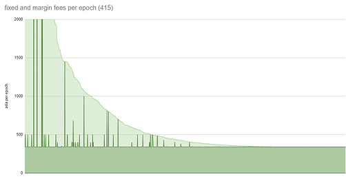

# PCP-001

Context: _The Parameter Committee has pursued an open deliberative process over the course of months in the lead up to the recommendation on PCP-001, represented in part in the responses made by the Cardano Foundation (_[_The Cardano Foundation's Response to the Parameter Committee Recommendation in PCP-001_](https://forum.cardano.org/t/the-cardano-foundations-response-to-the-parameter-committee-recommendation-in-pcp-001/121903)_) and by IOG (_[_IOG's Response to the Parameter Committee Recommendation on PCP-001_](https://forum.cardano.org/t/iogs-response-to-the-parameter-committee-recommendation-on-pcp-001/122965)_). But after the first iteration, we see a need to gather and summarize our reasoning (that of the committee and the community) in one place. Over time we hope to build a body of evidence and reasoning that can be referenced, revised, and added to by those protecting and fulfilling Cardano’s value._



### **Recommendation and Summary:**

The committee recommends a decrease of minPoolCost (mPC) to 170.\
Changing both parameters at the same time is not recommended, due to potential unforeseen cross effects, but this does not constitute an exclusion of a change in k in the future.

Both parameters are theorised to have a stark effect on pool operations and profitability, which is why changing them at once was seen as suboptimal. A reduction in mPC is seen generally as less invasive and more valuable at this point in time, since lowering the fee to a new mPC threshold of 170 Ada is optional for SPOs, and impacts Return on Staking for SPOs with a smaller (delegated) stake significantly, whereas only minimally for larger SPOs. Also the SPO poll, conducted by CF and PC members, concluded in favour of a mPC reduction.

Key arguments for lowering minPoolCost:

* The natural progress in the inflation model, and the increased effort to operate a pool in comparison to when mPC was set initially, has made it difficult for smaller pools to remain economically viable and remain competitive. Both, the competitiveness and economic viability of pools is not only paramount for the network at large, but also increasingly important for a potential increase in k.
* mPC is the threshold for a range of options SPOs can choose for their fee structure. This means that lowering mPC increases the options SPOs have without directly forcing any SPO to make a change.
* The protocol treasury balance is above forecast, and less inflow due to a decrease in mPC poses no danger to long term economic stability.
* The Parameter Committee does not consider Sybil attacks feasible with mPC=170.

### **Answers to PCP-001 questions:**

_1. What is the largest amount of nodes possible before block distribution times drop below critical thresholds? (Networking Perspective)_

Research and tests have shown that k=500 or 1000 are orders of magnitude away from a point where topology and network quality would suffer considerably, provided each pool remains qualitatively valuable to the network.

_2. What values for k are sensible/optimal from an economic perspective, considering the effects on other parameters a change would have and costs to operate._

k has no effects on profitability of the amount of optimal pools. Lowering minPoolCost is recommended, due to the natural decrease in revenue (progress of inflation model) and increase in costs to operate a pool well: backups, redundancy, disk space, time spent in community.

_3. Are small incremental changes of k better than a large change?_

A constantly moving target of saturation levels (smaller incremental changes) is seen as more manageable by delegators and pools alike, due to ease in communication and smaller effects on the penalty of potential temporary oversaturation.

_4. Which minPoolCost is minimally needed to reach a secure threshold against Sybil attacks?_

Research assumes that everyone is playing the same game, non-myopically, aiming to maximise their rewards/payoffs, in which case mPC is not required for Sybil attacks. However, an adversary’s interest is not one of game theoretical optima, but of attacking/destroying the system by accumulating enough delegated stake to alter/control consensus. The minimum value of mPC needed to protect against this type of adversary, is dependent on the total cost of attack - assuming USD cost equivalence, mPC can securely be lowered from its initial and current value of 340, but not to 0 until alternative research or a change in the rules emerge.

### **Individual Group Recommendations**

**Networking:**

* k=500
* mPC = down, not 0, middle ground preferred

Increasing k doesn’t drive a large improvement in topology, and only a marginal decrease in efficiency, provided the quality of the pools are good. An increase in revenue, due to lowering mPC can potentially increase the quality of smaller pools.

Further detailed research and analysis will be published in a series of blog posts.

**Technical:**

* k=500 or up
* mPC = down, not 0, 50% good middle ground

Due to progress in the inflation model (less revenue) mPC needs an update in costs so that small pools remain economically viable. By halving mPC we would not enforce but allow (low-cost market pressure) a pool to remain competitive towards his delegators, while at the same time, small pools’ own economics are less sustainable and much more prone to extreme cost- and time-savings. This skewed incentive scheme can scare away correctly calculating professional businesses, generally providing qualitative value to the network, and increase free-time, goodwill hobby operations.

An increase in network size participation poses a decrease in rewards single pool operators could expect ideally when saturated and forces saturated pools to split/open multiple pools.

Further analysis can be found in the Appendix “SPO poll - reward sharing scheme” and the CFs statement on PCP001.

**Economic:**

* k=500
* mPC = down, maybe 0, but not without further research. Non-drastic change preferred.

Originally, shortly before the Shelley launch, in reviewing the incentives, spec engineers in formal methods and architecture noticed that there was a ‘lambda’ parameter (between 0 and 1) that was basically the fraction by which adversaries could undercut everyone else on costs. If this param was 0 then everything collapsed to 0, i.e. the sybil attack became cheap, but there was no mechanism in the design to make sure this parameter was bigger than 0. So one was added: minPoolCost, to prevent adversaries from undercutting everyone and making themselves look super-competitive.

If someone creates many pools, they will not be attractive to first mover delegates, but allowing mPC = 0 on the other hand, removes this first mover delegation counter incentive.

From an analytical perspective this really has to do with how myopic the players are - if they are reasonably non-myopic, it won’t matter. In the original paper it was argued it didn’t matter because participants were to be thought of as being non-myopic.

Furthermore, research is assuming that everyone is playing the same game, and trying to maximize their rewards/payoffs (in which case min-fee is not needed). But the whole point of mPC is that an adversary is playing by the same rules but for a different payoff: their interest is not profiting from SPO rewards but from attacking/destroying the system by accumulating enough delegated stake to alter consensus. This means an adversary in the SPO game is prepared to lose money if it means they can accumulate enough stake to do something nefarious.

However, most importantly, just because it works in theory doesn’t mean it works in practice. But it does at least need to work in theory, or it will (almost certainly) not work in practice. So the theory analysis is necessary but not sufficient for it to work in practice. Removing minPoolCost remains an open option, either by new analysis proving it isn’t necessary, or by adjusting the game rules for it not to be necessary. But this needs to happen safely, and not in a rash drop to zero, observing what might happen in the extreme case.

Thus, lowering mPC is supported, as the initially assumed values for calculating the counter incentive mPC=340 (ADA price, inflation model, SPO costs, etc.) have changed.

**Other (IOG Research Team, SPO representatives, Communication Team):**

The RSS is continuously under review and analysis by IOG researchers, who support the idea to halve and then, after further learnings, potentially even completely remove minPoolCost.

The Community representatives are in favour of the changes, as lowering mPC is mutually beneficial for all SPOs, while being the least obtrusive, due to its optionality, and thus puts minimal pressure on SPOs, unlike a change in k. However, increasing k may be favourable at a later stage.

The Communication team recommends to lower mPC and keep k for the time being, as a change in k, whether incremental or drastic, requires extensive attention and actions to be taken from network participants.

### Appendix:

**SPO poll - reward sharing scheme**

Data analysis on k1000

Community Member [https://twitter.com/Ada4goodP](https://twitter.com/Ada4goodP) combined 3 data sets

1. All active pools and their pool parameters.\
   Thank you[ @cardanoapexpool](https://twitter.com/cardanoapexpool) for your great Koios script!
2. A list of pool groups. Thank you[ @BalanceData22](https://twitter.com/BalanceData22) for your API.
3. The Poll results. Thank you[ @ada\_stat](https://twitter.com/ada\_stat) for you poll results API

The goal was to try to get some sense of what would happen with the various pools if K would be increased. How many Single pools would saturate and how much stake would that be. The same for the Multi pool groups.



The first dashboard shows a General overview of the pool landscape with some filters that are preconfigured and some that you can change for yourself. Note that you can also filter the dashboard by clicking on a pool or pool group: The second dashboard zooms in on the multi pool groups and shows only those MPOs that will not be affected when K moves to 1000. The rationale here is that even if some pools of a group will get saturated, the group as a whole is only “affected” if that saturated stake cannot move to one of their other pools. The other 3 dashboards consequently show the Unaffected Single pools, Affected MPOs and Affected Single Pools

I used the data to make up my own mind. I have my own arguments why I think that increasing K might not be the best way forward, but that’s not the reason why I am posting these reports. I hope that others find it useful and use the information to adhere to the Cardano way, which imho is: “Measure twice, cut once” The important word for me here is “Measure” and I hope I contributed a bit to this ethos.

Basic disclaimers

* Even Though these dashboards show data, I have my own filters and assumptions in there.
* There probably are errors in these reports. It’s not meant to be a work of art but started as a quick way to help my own voting choice. Please let me know and I will see if I can improve them
* The data is not dynamic. I have to manually update them.
* I have used 2 filters to rule out pools that I think should be ruled out in this analysis. You might not agree with this. One of the filters is the “Regular pool” filter. It rules out pools with higher than 100k average stake per delegator. The other filter is the “margin” filter where I rule out all pools with higher than 20% margin.

**The effect of minPoolCost**

minPoolCost was introduced with the Shelley launch in August 2020 to fulfll two tasks:

* It should support the pledge factor a0 as a Sybil attack mitigation.
* It should guarantee the pool operators a minimum budget for the professional operation of the servers.

The next chart shows all 1075 stake pool fees for Epoch 415 (1075 pools produced at least one block)

Dark green is the part coming from the configured minPoolCost\
Light green comes from the configured margin %

<figure><figcaption></figcaption></figure>

It is important to note: By potentially halving minPoolCost we don’t enforce but allow the operators to reduce their “floor” income. We can clearly expect a high competitive pressure for small pool operators (right half in the chart) to go to the new minimum, and so halve their operational budget. The larger pools don’t suffer that much.

The next chart is calculating the current operator fees per month, assuming an ada price of 0.3 USD. It is likely that especially the smaller pools - which mainly demand a reduction of minPoolCost - will have to offer the new lower limit. The dotted line shows a new fee rewards curve that will probably result from this.

<figure><figcaption></figcaption></figure>

Since the rewards per block have decreased from 1800 to 500 ada nowadays, this 340 ada minPoolCost has a much stronger effect, especially for those small pools that generate only one or very few blocks per epoch.

The following table shows what portion of the revenue the minPoolCost collects, depending on the number of blocks generated by the pool per epoch. For this purpose, the current value of 340 ada is contrasted with 3 theoretically lower values of 170, 85 and 0 ada.

<figure><figcaption></figcaption></figure>

The same data in a chart looks like this and also shows the little but constant effect on the delegator rewards, if minPoolCost would be lowered.

<figure><figcaption></figcaption></figure>

The most frequently mentioned suggestion (poll comments) to mitigate this significant competitive disadvantage of minPoolCost for small pools is to replace minPoolCost with a minMargin. This is therefore not a simple change of one of the existing parameters but would only be feasible by means of a hard fork and the introduction of a new parameter.

Reducing minPoolCost lowers the effect of the two original purposes, but in return clearly brings a significant improvement in competitiveness for small pools. One issue raised in the comments is that small pools need some time to improve their RoS (Return on Staking) value. This should be as good as possible when delegators are persuaded to seek a new pool. This could occur if the k-value is increased and thus the saturation point of currently filled pools is lowered.

Gradual change of k as saturated pools with many delegators cannot control and direct the movement of delgators. Less damage and negative effects for these participants if k is changed slowly and gradually.

The ideal pool as described in papers and design specifications is saturated with many individual wallet delegations. Delegations are anonymous and out of control of the pool operator.

An immediate and significant change of K, resulting in a halving of the saturation point will bring the Pool B Operator in a difficult situation on how to address exactly half but not more of his delegators stake, to move away from the currently perfectly shaped and operating pool.

<figure><figcaption></figcaption></figure>
